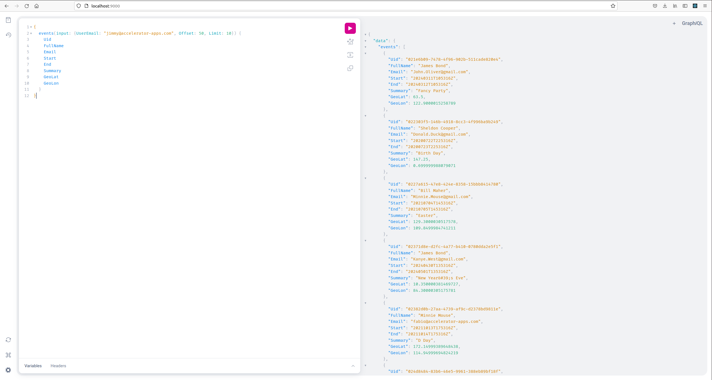

# Calendar App

A simulation of randomly generated calendar events that get stored to a database. Emphasis on concurrency and
multi-threading.

## Services and Supported Endpoints

### Generator

| Path                | Method | Params          | Possible Codes                                                                                      | Success Response |
|:--------------------|:-------|:----------------|:----------------------------------------------------------------------------------------------------|:-----------------|
| /events/:user_email | GET    | offset<br>limit | 200 - OK<br>204 - No Content<br>400 - Bad Request<br>404 - Not Found<br>500 - Internal Server Error | List of ics data |

### Consumer

| Path | Method  | Params | Possible Codes | Success Response |
|:-----|:--------|:-------|:---------------|:-----------------|
| /    | GraphQL | Query  | NA             | List of events   |

## Simulation

Run `./scripts/setup.sh` on Linux machine with Docker. Or perform equivalent actions on a different machine.

## GraphQL Playground

If you use default settings, you can use http://localhost:9000 to test queries, such as:

```
{
  events(input: {UserEmail: "jimmy@accelerator-apps.com", Offset: 50, Limit: 10}) {
    Uid
    FullName
    Email
    Start
    End
    Summary
    GeoLat
    GeoLon
  }
}
```

Example result:


